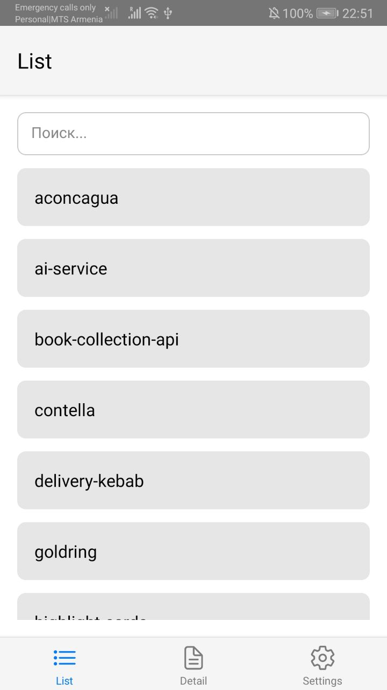
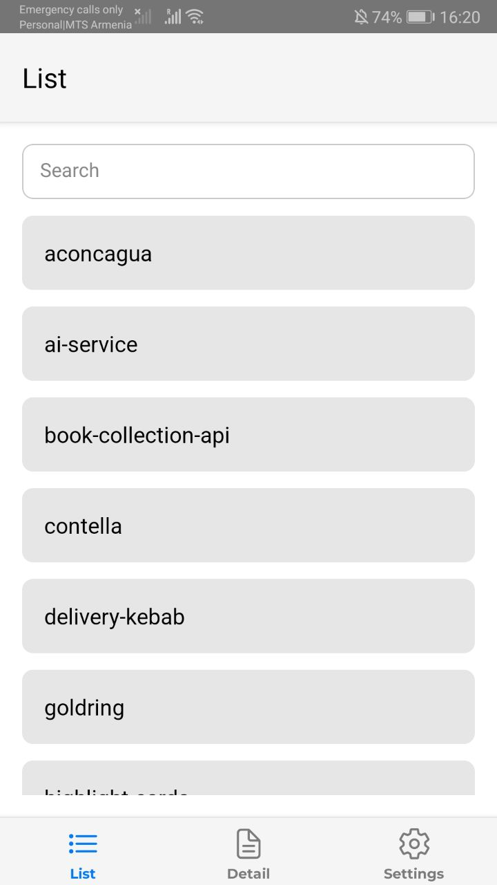
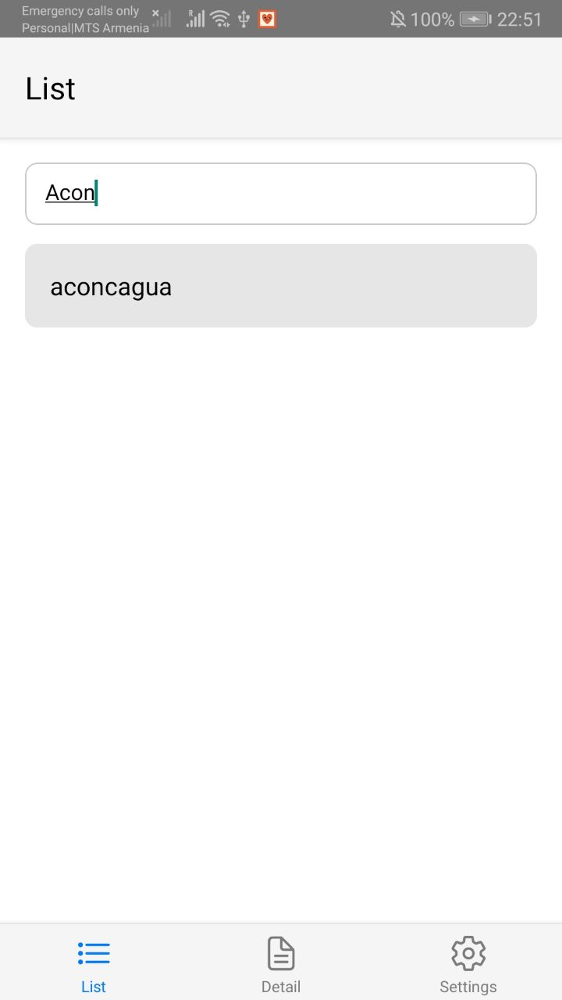
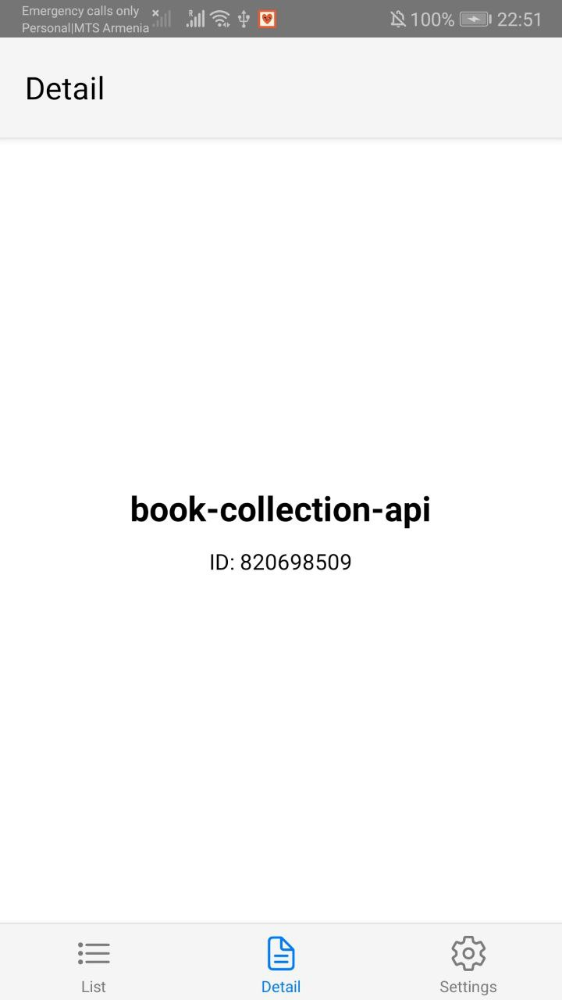
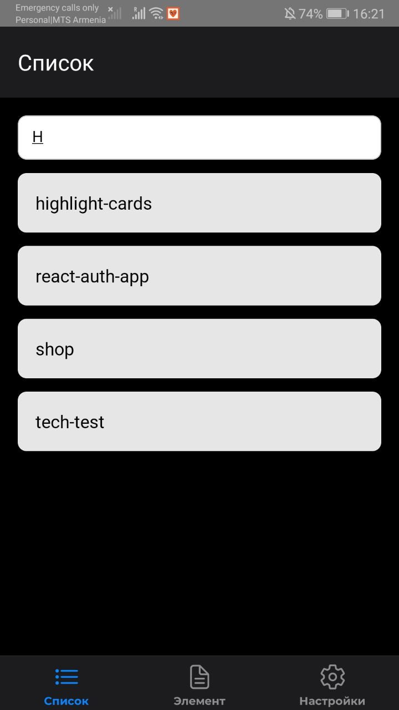

# TestApp

React Native приложение. Поддерживает:

- 🌙 Переключение светлой/тёмной темы
- 🌍 Переключение языка (русский/английский)
- 🧾 Список GitHub-репозиториев:
  - Поиск по названию
  - Пагинация
  - Pull-to-refresh
  - Детальный просмотр элемента
- 🔔 Локальные уведомления через Notifee
- ⚙️ Экран настроек: смена языка, темы, выход
- 🔐 Авторизация с сохранением состояния в AsyncStorage
- 🧭 Навигация через `@react-navigation`
- 🎨 Иконки табов через `react-native-vector-icons`
- 🔤 Подключены переводы через `i18next`
- 🖋 Кастомный шрифт Montserrat

---

## 🚀 Запуск

```bash
npm install
npx react-native start
npx react-native run-android
```

---

## 🔐 Авторизация

На экране входа нажмите **"Войти"** (без валидации). Приложение сохранит флаг авторизации и перенаправит в основную навигацию.
Логин для входа: `admin`  
Пароль: `1234`

---

## 🧩 Библиотеки

- [`@notifee/react-native`](https://notifee.app/react-native/docs/overview) — уведомления
- [`react-native-vector-icons`](https://github.com/oblador/react-native-vector-icons)
- [`react-i18next`](https://react.i18next.com/) — переводы
- [`@react-navigation`](https://reactnavigation.org/)
- [`redux-toolkit`, `react-redux`]
- [`@react-native-async-storage/async-storage`]

---

## Скриншоты

### Авторизация


### Список элементов


### Элемент


### Настройки


### Темная тема и поиск

